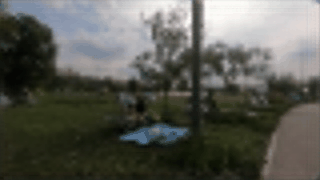

**Tabla de contenidos**

- [ELSR-torch](#elsr-torch)
  * [Requisitos](#requirements)
  * [Conjunto de datos](#dataset)
	+ [Aumentación de datos](#data-augmentation)
  * [Modelo](#model)
	+ [PixelShuffle](#pixelshuffle)
  * [Uso](#usage)
  * [Entrenamiento](#training)
    + [Paso de entrenamiento 1](#training-step-1)
    + [Paso de entrenamiento 2](#training-step-2)
    + [Paso de entrenamiento 3](#training-step-3)
  * [Resultados](#results)
	+ [Pruebas](#tests)
	+ [Superresolución de vídeo en tiempo real de bajo consumo](#low-power-real-time-video-super-resolution)
  * [Informe del proyecto](#project-report)


# ELSR-torch
Implementación del artículo ["ELSR: Extreme Low-Power Super Resolution Network For Mobile Devices"](https://arxiv.org/abs/2208.14600) utilizando PyTorch. El código replica el método propuesto por el artículo, pero está diseñado para entrenarse en dispositivos con recursos limitados. Con ese fin, el conjunto de datos es mucho más pequeño y el entrenamiento es significativamente más sencillo.

### Requisitos
 - pytorch=1.13.1
 - opencv=4.7.0
 - pillow=9.4.0
 - matplotlib

Si utiliza Anaconda en Windows, puede simplemente:
```bash
conda create -n elsr --file requirements.txt 
```
Una vez instalados los paquetes requeridos, descargue el [conjunto de datos](https://drive.google.com/drive/folders/158bbeXr6EtCiuLI5wSh3SYRWMaWxK0Mq?usp=sharing) que utilicé para ejecutar el entrenamiento. Alternativamente, puede descargar el conjunto de datos REDS completo desde [aquí](https://seungjunnah.github.io/Datasets/reds.html).

## Conjunto de datos
ELSR se entrena en el conjunto de datos REDS, compuesto por conjuntos de 300 vídeos, cada uno con un tipo de degradación diferente. Mi modelo se entrena en una versión drásticamente reducida del conjunto de datos, que contiene solo 30 vídeos con una resolución menor (el conjunto de datos original era demasiado grande para que pudiera entrenarlo). El conjunto de datos (archivos h5) está disponible en el siguiente enlace: [https://drive.google.com/drive/folders/158bbeXr6EtCiuLI5wSh3SYRWMaWxK0Mq?usp=sharing](https://drive.google.com/drive/folders/158bbeXr6EtCiuLI5wSh3SYRWMaWxK0Mq?usp=sharing).

### Aumentación de datos
Para evitar el sobreajuste y lograr mejores resultados de entrenamiento, he aplicado alguna aumentación de datos aleatoria (consulte augment_data() en [preprocessing.py](./preprocessing.py)). A continuación se muestra un ejemplo de aumentación mediante rotación:


## Modelo
El modelo ELSR es una pequeña red neuronal convolucional subpíxel con 6 capas. Solo 5 de ellas tienen parámetros aprendibles. La arquitectura se muestra en la siguiente imagen:


### PixelShuffle
El bloque PixelShuffle (también conocido como depth2space) realiza un reescalado hacia arriba (upsampling) computacionalmente eficiente reorganizando los píxeles en una imagen para aumentar su resolución espacial. Formalmente, sea **x** un tensor de tamaño (**batch_size**, **C_in**, **H_in**, **W_in**), donde **C_in** es el número de canales de entrada, y **H_in** y **W_in** son la altura y el ancho de la entrada, respectivamente. El objetivo de PixelShuffle es reescalar la resolución espacial de **x** por un factor de **r**, lo que significa que la salida debe ser un tensor de tamaño (**batch_size**, **C_out**, **H_in** * **r**, **W_in** * **r**), donde **C_out** = **C_in** // **r^2**.

## Uso
Para entrenar el modelo, ejecute:
```bash
python training.py	\
	--train <training_dataset_path>	\
	--val <validation_dataset_path>	\
	--out <path_for_best_model>	\
	--weights <weights_path(not required)>
```
Para probar el modelo, ejecute:
```bash
python training.py	\
	--weights <weights_path(not required)>	\
	--input <input_frames_path>
```

## Entrenamiento
El entrenamiento del modelo ELSR se divide en 6 pasos en el artículo, utilizando diferentes funciones de pérdida y diferentes tamaños de parches de fotogramas. No obstante, para esta implementación las imágenes del conjunto de datos son mucho más pequeñas, por lo que solo se necesitan 3 pasos, ya que podemos utilizar imágenes a tamaño completo. Tenga en cuenta que se ha reducido el número de épocas y que el agendador de tasa de aprendizaje del primer paso de entrenamiento se utiliza también en los demás.

### Paso de entrenamiento 1
Entrene el modelo en el conjunto de datos x2 utilizando la pérdida L1:
```bash
python training.py \
	--train "datasets/h5/train_X2.h5" \
	--val "datasets/h5/val_X2.h5" \
	--out "checkpoints/" \
	--scale 2 \
	--epochs 300 \
	--loss "mae" \
	--lr 0.01
```

### Paso de entrenamiento 2
Realice un ajuste fino del modelo preentrenado del paso 1 utilizando el conjunto de datos x4. Utilice la pérdida L1 y una tasa de aprendizaje más alta. En el artículo, esto se realiza en 2 pasos, utilizando diferentes tamaños de parches.
```bash
python training.py \
	--train "datasets/h5/train_X4.h5" \
	--val "datasets/h5/val_X4.h5" \
	--out "checkpoints/" \
	--scale 4 \
	--epochs 50 \
	--loss "mae" \
	--lr 0.05 \
	--weights "best_X2_model.pth"
```

### Paso de entrenamiento 3
Realice un ajuste fino del modelo preentrenado del paso 2 utilizando el conjunto de datos x4. Utilice la pérdida MSE y una tasa de aprendizaje más baja. En el artículo, esto se realiza en 3 pasos, utilizando diferentes tamaños de parches.
```bash
python training.py \
	--train "datasets/h5/train_X4.h5" \
	--val "datasets/h5/val_X4.h5" \
	--out "checkpoints/" \
	--scale 4 \
	--epochs 250 \
	--loss "mse" \
	--lr 5e-3 --weights "best_X4_model.pth"
```

## Resultados
Debido al tamaño limitado del conjunto de datos, no pude replicar los resultados del artículo, pero efectivamente hay resultados interesantes que demuestran que la superresolución de vídeo puede lograrse con un modelo tan pequeño. Los gráficos a continuación muestran las pérdidas de entrenamiento a lo largo de cada paso de entrenamiento:


### Pruebas

La prueba de superresolución de un solo fotograma se realiza de la siguiente manera (la superresolución de vídeo se logra iterando la superresolución en cada fotograma):
 1. Cambiar el tamaño de la imagen de entrada a (image.height // upscale_factor, image.width // upscale_factor) utilizando interpolación bicúbica
 2. Calcular la imagen bicubic_upsampled de la imagen de baja resolución producida anteriormente mediante el mismo factor de reescalado hacia arriba, utilizando interpolación bicúbica
 3. Utilizar la imagen de baja resolución para predecir sr_image
 4. Calcular el PSNR entre sr_image y bicubic_upsampled
Los resultados se muestran a continuación:


El PSNR de la imagen generada ha resultado ser menor, pero las imágenes resultantes son más suaves, lo que hace que las imágenes más grandes tengan una mejor apariencia:


El desenfoque es evidente en las imágenes pixeladas:


### Superresolución de vídeo en tiempo real de bajo consumo
Por supuesto, se han realizado pruebas en vídeos. Para lograr la superresolución de vídeo en "tiempo real", el modelo debería ser capaz de producir al menos 30 FPS en dispositivos de borde. No pude probar el modelo en un dispositivo móvil, pero en la GPU el vídeo se produce a más de 2500 FPS (consulte [project_report.ipynb](./project_report.ipynb)). GIFs a continuación:

| GIF Bicúbico: 28.20 dB  | GIF ELSR: 28.45 dB    |
| ------------- | ------------- |
|   |   |

## Informe del proyecto
Puede encontrar un informe completo del proyecto en [este cuaderno](./project_report.ipynb).
